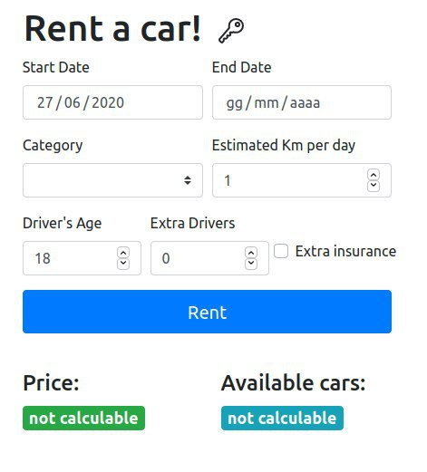

# Car Rental - Web application 1

### Instruction to install and run the application

_**Back-end**_
```
cd server
npm install
npm install -g nodemon
nodemon
```
_**Front-end**_
```
cd client
npm install
npm start
```
## Description of the application
### React client application routes

- Route `/`: redirect to login or to protected page (if authenticated)
- Route `/login`: page to handle the login 
- Route `/public/vehicles`: public page (list of vehicles)
- Route `/protected/rent`: interactive configuration page 
- Route `/protected/history`: this page shows rentals (past and active) of the logged user
- Route `/protected/future`:  this page shows future reservations of the logged user
- Route `/protected/payment`:  in this page user can pay for the desired rental

### REST API server

- POST `/api/login`
  - request parameters (none) and request body content (username,password)
  - response body content (username)
- POST `/api/logout`
- GET `/api/user`
  - request parameters (none)
  - response body content (username)


- GET `/api/vehicles`
  - request parameters (optionally categories and/or brands)
  - response body content (array of vehicles)
- GET `/api/vehicles/brands`
  - request parameters (none)
  - response body content (array of brands)   
- GET `/api/vehicles/available`
  - request parameters (startDate,endDate,category)
  - response body content (array of vehicles)
- GET `/api/vehicles/number`
  - request parameters (category)
  - response body content (number of vehicles for that category)


- GET `/api/rentals`
  - request parameters (none)
  - response body content (array of rentals)
- POST `/api/rentals`
  - request parameters (none) and request body content (info = {startDate, endDate, category})
  - response body content (randomly chosen vehicle)
- DELETE `/api/rentals`
  - request parameters (licenseplate and startDate)
  - response body content (empty)
- POST `/api/checkprice`
  - request parameters (none) and request body content (info = {startDate, endDate,category, km, age, extraDrivers, extraInsurance})
  - response body content (empty)
- POST `/api/pay`
  - request parameters (none) and request body content (fullName,CVVcode,cardNumber,price)
  - response body content (empty)

### Main React Components
  - `App` (in `App.js`): main component to switch between routes('/','/public/vehicles','/protected'). It provides the Context for authentication.
  - `LoginPage` (in `LoginPage.js`): handle the login process
  - `Header` (in `Header.js`): navbar (it changes between public page and protected pages)
- ##### Protected components (user must be authenticated)
  - `ProtectedPages` (in `ProtectedPages.js`): this component cointains all routes that require autentication and redirect to the right one
  - `PaymentPage` (in `PaymentPage.js`): component to handle the payment
  - `ConfigurationFilter` (in `ConfigurationFilter.js`): configurator component, user can set parameters for desired rental
  - `RentalList` (in `RentalList.js`): list of user's rentals
- ##### Public components
  - `PublicPage` (in `PublicPage.js`): it contains SideFilter and VehicleList
  - `SideFilter` (in `SideFilter.js`): it allows user to filter the vehicle list using checkbox
  - `VehicleList` (in `VehicleList.js`): table of vehicles (user can sort table by category,brand or model)

(only _main_ components, minor ones may be skipped)

### Server database

- Table `Users` - contains: username(PK), hash
- Table `Vehicles` - contains: license plate(PK), category, brand, model
- Table `Rentals` - contains: license plate(PK,FK), start date(PK), end date, user(FK)

### Test users

* dev, enter
* enrico, masala
* luigi, derussis (frequent customer)
* luca, giorgino
* voto, trenta? (frequent customer)

### Main form screenshot

